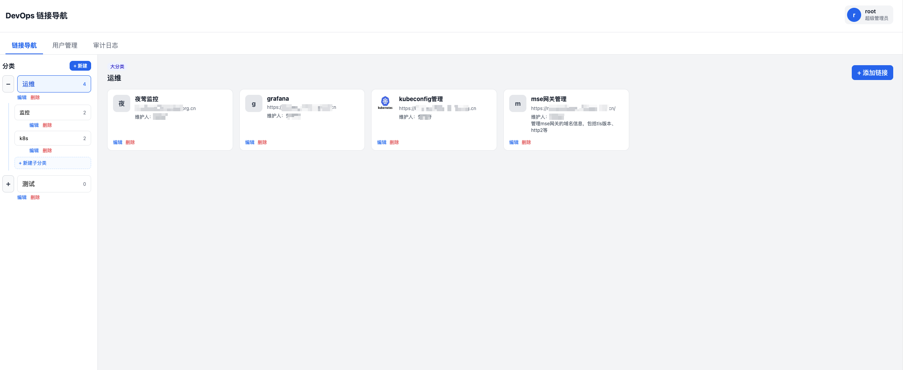

# DevOps 链接导航

按分类汇总 DevOps 常用网站链接的平台，支持图标上传、维护人、备注与权限管理。

## 截图

## 功能

- **分类管理**（管理员）：创建、编辑、删除分类
- **链接管理**（管理员）：在分类下添加链接（名称、地址、图标、维护人、备注）
- **LDAP 登录**：支持第三方 LDAP/AD 域账号登录（首次登录自动创建本地用户）
- **用户管理**（管理员）：创建、编辑、禁用/启用、删除本地用户
- **审计日志**（管理员）：记录登录、用户与分类/链接操作
- **权限**
  - **管理员**：可管理分类、链接、用户，查看审计日志
  - **游客**：只读浏览分类与链接
- **数据持久化**：MySQL

## 快速开始

### 1. 配置

复制并修改配置：

```bash
cp config-example.yaml config.yaml
```

### 2. 启动后端

```bash
go mod tidy
go run ./cmd/server
```

服务默认 `http://127.0.0.1:8090`（避免与本机 IAM 等占用 8080 的服务冲突），首次启动自动创建数据库表与默认账号：

| 角色 | 用户名 | 默认密码 |
|------|--------|----------|
| 管理员 | admin | Admin@123456 |
| 游客 | guest | Guest@123456 |

### 3. 启动前端（开发）

```bash
cd frontend
npm install
npm run dev
```

### 4. 生产构建

```bash
cd frontend && npm install && npm run build
cd .. && go run ./cmd/server
```

构建后后端会自动托管 `frontend/dist`。

### LDAP 配置

在 `config.yaml` 的 `auth.ldap` 中启用并填写连接信息：

```yaml
auth:
  ldap:
    enabled: true
    host: "ldap.example.com"
    base_dn: "dc=example,dc=com"
    bind_dn: "cn=readonly,dc=example,dc=com"
    bind_password: "secret"
    user_filter: "(uid=%s)"
    default_role: "guest"   # 首次 LDAP 登录默认角色：guest 或 admin
```

## API 概览

| 方法 | 路径 | 权限 | 说明 |
|------|------|------|------|
| POST | /api/login | 公开 | 本地登录 |
| POST | /api/login/ldap | 公开 | LDAP 登录 |
| GET | /api/auth/providers | 公开 | 可用第三方登录方式 |
| POST | /api/logout | 登录 | 登出 |
| GET | /api/me | 登录 | 当前用户信息 |
| GET | /api/categories | 登录 | 分类及链接列表 |
| POST | /api/categories | 管理员 | 创建分类 |
| PUT | /api/categories/:id | 管理员 | 更新分类 |
| DELETE | /api/categories/:id | 管理员 | 删除分类 |
| POST | /api/links | 管理员 | 创建链接 |
| PUT | /api/links/:id | 管理员 | 更新链接 |
| DELETE | /api/links/:id | 管理员 | 删除链接 |
| POST | /api/upload/icon | 管理员 | 上传图标 |
| GET | /api/users | 管理员 | 用户列表 |
| POST | /api/users | 管理员 | 创建用户 |
| PUT | /api/users/:id | 管理员 | 更新用户 |
| DELETE | /api/users/:id | 管理员 | 删除用户 |
| GET | /api/audit-logs | 管理员 | 审计日志 |

## 目录结构

```
devops-links/
├── cmd/server/          # 入口
├── internal/
│   ├── auth/            # JWT 认证
│   ├── config/          # 配置
│   ├── httpapi/         # HTTP API
│   ├── ldapauth/        # LDAP 认证
│   └── store/           # MySQL 模型
├── frontend/            # React 前端
├── deploy/sql/          # SQL 脚本
└── data/uploads/icons/  # 上传图标（运行时生成）
```
